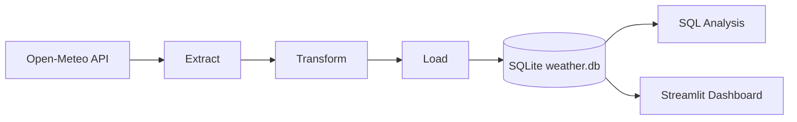
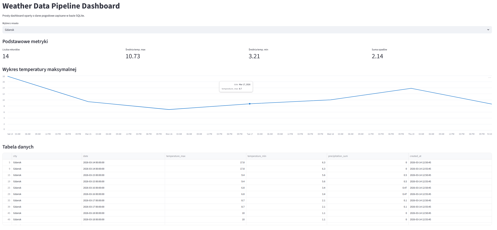
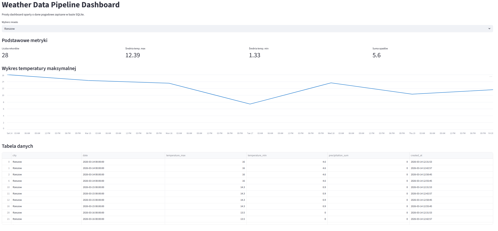

# Weather Data Pipeline

Projekt portfolio pokazujący budowę prostego pipeline'u danych z publicznego API pogodowego.  
Aplikacja pobiera dane dla wielu miast, przekształca je w Pythonie, zapisuje do bazy SQLite, analizuje za pomocą SQL i prezentuje w dashboardzie Streamlit.

---

# Cel projektu

Celem projektu było zbudowanie prostego, ale kompletnego przepływu danych typu:

API → transformacja → baza danych → analiza → dashboard

Projekt został przygotowany jako przykład do portfolio na GitHub, pokazujący praktyczne wykorzystanie:

- Python
- API
- pandas
- SQL
- Streamlit

---

# Zakres projektu

Projekt realizuje następujące zadania:

- pobieranie danych pogodowych z publicznego API **Open-Meteo**
- przetwarzanie danych do formatu tabelarycznego
- zapis danych do bazy **SQLite**
- analiza danych przy użyciu **SQL i pandas**
- prezentacja danych w aplikacji **Streamlit**
- obsługa wielu miast z pliku konfiguracyjnego

---

# Technologie

- Python
- requests
- pandas
- SQLite
- SQL
- Streamlit
- python-dotenv
- Docker

---

# Struktura projektu


```text
weather-data-pipeline/
│
├── app/
│   ├── analyze_weather_data.py
│   ├── dashboard.py
│   ├── init_db.py
│   ├── logger.py
│   ├── settings.py
│   └── pipeline/
│       ├── config.py
│       ├── extract.py
│       ├── load.py
│       ├── run_pipeline.py
│       └── transform.py
│
├── data/
│   └── weather.db (tworzony lokalnie po uruchomieniu projektu)
│
├── docs/
│   
│
├── sql/
│   └── schema.sql
│
├── .env.example
├── .gitignore
├── Dockerfile
├── README.md
└── requirements.txt
```

---

# Opis działania pipeline'u

## 1. Extract

Dane pogodowe są pobierane z publicznego API **Open-Meteo** dla wybranych miast.

---

## 2. Transform

Dane JSON są przekształcane do `pandas.DataFrame`, a następnie przygotowywane do dalszej analizy i zapisu.

---

## 3. Load

Przetworzone dane są zapisywane do lokalnej bazy **SQLite** w tabeli `weather_data`.

---

## 4. Analysis

Dane mogą być analizowane za pomocą zapytań SQL oraz skryptu Python wykorzystującego **pandas**.

---

## 5. Dashboard

Dane są prezentowane w prostym dashboardzie **Streamlit** z filtrowaniem po mieście.

---
## Logowanie

Projekt wykorzystuje moduł `logging` zamiast samych `print()`, dzięki czemu podczas uruchamiania pipeline'u w konsoli pojawiają się czytelne komunikaty z timestampem, poziomem logowania i nazwą modułu.

---
## Diagram architektury


---
## Screenshots
### Dashboard Gdańsk



### Dashboard Rzeszów



# Konfiguracja

Lista miast znajduje się w pliku:

```
app/pipeline/config.py
```

Przykładowo projekt pobiera dane dla:

- Rzeszow
- Krakow
- Warsaw
- Gdansk

Projekt korzysta z pliku `.env`, w którym można ustawić podstawowe parametry uruchomienia, np.:

- `API_TIMEOUT`
- `TIMEZONE`
- `DB_PATH`
- `TABLE_NAME`
- `LOG_LEVEL`

Przykładowa konfiguracja znajduje się w pliku:

```text
.env.example
```
---


# Jak uruchomić projekt

## 1. Sklonuj repozytorium

```bash
git clone https://github.com/kutpiotr/weather-data-pipeline
cd weather-data-pipeline
```

---

### 2. Utwórz i aktywuj środowisko wirtualne

#### Windows PowerShell

```powershell
python -m venv .venv
.venv\Scripts\Activate.ps1
```

### 3. Zainstaluj zależności

```bash
pip install -r requirements.txt
```

### 4. Utwórz plik `.env`

Skopiuj plik przykładowy:

```powershell
copy .env.example .env
```

### 5. Utwórz bazę danych

```bash
python -m app.init_db
```

### 6. Uruchom pipeline danych

```bash
python -m app.pipeline.run_pipeline
```

### 7. Uruchom analizę danych

```bash
python -m app.analyze_weather_data
```

### 8. Uruchom dashboard

```bash
python -m streamlit run app/dashboard.py
```

---

# Przykładowe funkcjonalności

- pobieranie danych pogodowych dla wielu miast
- zapis danych do bazy SQL
- analiza temperatur i opadów
- filtrowanie danych po mieście
- wizualizacja temperatury na wykresie
- dashboard danych pogodowych

---

# Docker

Projekt zawiera opcjonalny `Dockerfile`, który pozwala uruchomić dashboard Streamlit w kontenerze.

Przykładowe budowanie obrazu:

```bash
docker build -t weather-data-pipeline .
```

Przykładowe uruchomienie:

```bash
docker run -p 8501:8501 weather-data-pipeline
```

# Możliwe ulepszenia

Projekt można rozbudować o:

- usuwanie duplikatów danych
- automatyczne odświeżanie pipeline'u
- logowanie błędów
- więcej wykresów w dashboardzie
- deployment aplikacji online

---

# Status projektu

Projekt został przygotowany jako projekt **portfolio na GitHub** i jest dalej rozwijany.
